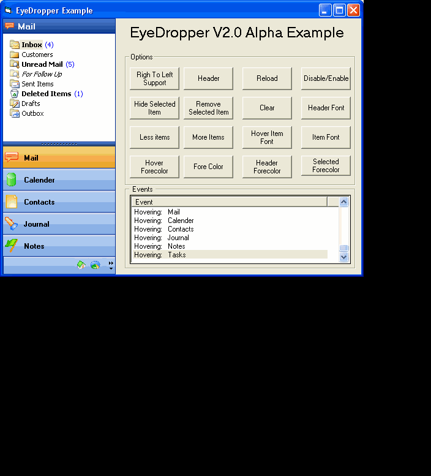



## Outlook 2003 SideBar V2\.02 Alpha \(\*Updated 10/02/2005\*\)

### Description

A complete new rebuild of my award winning EyeDropper Control. Now a 100% Dependency free control.

Better Drawing, Better Font handling, No Dependencies, Better menu Handling... to many to mention.

The control now uses subclassing from Paul Caton (thanks Paul) And the cMemdc for drawing From Vlad Vissoultchev (Thanks Vlad) Awesome code From two very talented programmers.

Take a look and tell me what you think. As Always comments and constructive critisim is always welcome.

Note:

1) You MUST Copy the WinSubHook.tlb Located in then tlb folder to you system folder.

2) The Control Doesn't Support 32bit Alpha Icons As Yet (Vlad If You have Any Idea on how to do this - I Would Be Very Interested indeed)

Regards

Gary

----

Update: 09/02/2005

Resizing Of Containers Where Causeing A Flicker. Now Sorted.

Toolbar Items Now Draw And Display The Same As The Original MSOutlook Sidebar.

----

Update: 10/02/2005

Disabled Icons Now Render To Grey.

Fixed The Max Visible Items On Redraw/Resize.

Fixed Toolbar Drawing (Icons Not Displayed Correctly When Sizing.

Added Custom Color Property(As A Trial).

Enjoy.

Thanks Gary
 
### More Info
 

             |
---                |---
**Submitted On**   |2005-02-09 10:45:38
**By**             |[Phantom Man](https://github.com/Planet-Source-Code/PSCIndex/blob/master/ByAuthor/phantom-man.md)
**Level**          |Advanced
**User Rating**    |5.0 (185 globes from 37 users)
**Compatibility**  |VB 6\.0
**Category**       |[Custom Controls/ Forms/  Menus](https://github.com/Planet-Source-Code/PSCIndex/blob/master/ByCategory/custom-controls-forms-menus__1-4.md)
**World**          |[Visual Basic](https://github.com/Planet-Source-Code/PSCIndex/blob/master/ByWorld/visual-basic.md)
**Archive File**   |[Outlook\_201851082102005\.zip](https://github.com/Planet-Source-Code/phantom-man-outlook-2003-sidebar-v2-02-alpha-updated-10-02-2005__1-58782/archive/master.zip)

